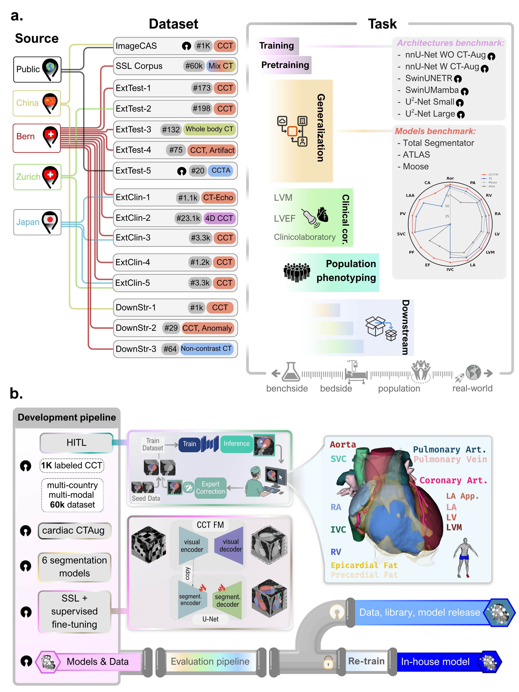

# CCT-FM

**A Unified Framework for Comprehensive Cardiac CT Segmentation and Phenotyping: Human-in-the-Loop Data Annotation, Vision Foundation Model Development, Multicenter Evaluation and Clinical Validation**

[](https://arxiv.org/abs/2607.11287)

## Abstract

> Comprehensive quantification of cardiac structures from computed tomography (CT) remains limited not by data availability but by the scalability of measurements, which makes routine use impractical. Here we present a unified framework for comprehensive cardiac CT segmentation and phenotyping that combines a human-in-the-loop annotation pipeline, a cardiac CT augmentation technique, and a self-supervised foundation model pre-trained on 60,000 unlabeled cardiac CT scans. Using this approach, we assembled the largest and most comprehensive expert-annotated cardiac CT segmentation dataset to date, comprising 1598 cases and 14 distinct cardiac structures (1000 for training, 598 for the external test set). Across five external datasets, the framework segmented all structures more accurately and comprehensively than existing open-source tools. Self-supervised pre-training improved labeling efficiency, with the most significant gains observed during external evaluation in the low-data regime. Benchmarking across convolutional, transformer, and state-space architectures showed comparable performance, indicating that data quality and pre-training, rather than architecture, drove accuracy. The framework was scaled to population-level phenotyping, with segmented anatomy that carries functionally relevant information about ventricular function and disease severity beyond demographic variables. By openly releasing the largest dataset with human labels, code, model weights, a CT augmentation library, and software, this work provides a reproducible foundation for opportunistic cardiac phenotyping from routinely acquired CT scans.

## Overview




## Clinical Evaluation
Code for the clinical and population-scale evaluation is in [`code-clinical-analysis/`](./code-clinical-analysis). It tests whether the CT-derived substructure volumes carry information about clinical and laboratory parameters beyond demographics; the folder's README documents the expected data schema. Patient-level data are not released due to data-sharing agreements, but reasonable requests can be directed to the corresponding author.

## CO2 Emission Computation
Code for the carbon-footprint estimates is in [`code-co2-emission/`](./code-co2-emission). Emissions for pre-training, training and per-patient inference are computed with the Green Algorithms framework (Lannelongue et al., *Advanced Science*, 2021), with all hardware and grid inputs provided.


# Citation
Please kindly cite the following paper if you use this repository.

```
@article{kazaj2026unified,
  title  = {A Unified Framework for Comprehensive Cardiac CT Segmentation and Phenotyping:
Human-in-the-Loop Data Annotation, Vision Foundation Model Development, Multicenter Evaluation and Clinical Validation},
  author = {Mohammadi Kazaj, Pooya and Weber, Leo Fridolin and Xie, Wen and Safavi-Naini, Seyed Amir Ahmad and Stark,
Anselm and Baj, Giovanni and Mokhtari, Ali and Yoshida, Toshiya and Ryffel, Christoph and Okuno, Taishi and Akashi,
Yoshihiro and Buechel, Ronny R. and Pilgrim, Thomas and Valenzuela, Waldo and Siontis, George C. M. and Xu, Xiaowei
and Hundertmark, Moritz and Windecker, Stephan and Grani, Christoph and Shiri, Isaac},
  journal = {arXiv preprint arXiv:2607.11287},
  year   = {2026},
  doi    = {10.48550/arXiv.2607.11287},
  url    = {https://arxiv.org/abs/2607.11287}
}
```
```
Mohammadi Kazaj, P., Weber, L. F., Xie, W., Safavi-Naini, S. A. A., Stark, A., Baj, G., Mokhtari, A., Yoshida, T., Ryffel, C., Okuno, T., Akashi, Y., Buechel, R. R., Pilgrim, T., Valenzuela, W., Siontis, G. C. M., Xu, X., Hundertmark, M., Windecker, S., Grani, C., Shiri, I. (2026). A unified framework for comprehensive cardiac CT segmentation and phenotyping: human-in-the-loop data annotation, vision foundation model development, multicenter evaluation and clinical validation. arXiv preprint arXiv:2607.11287.
```
